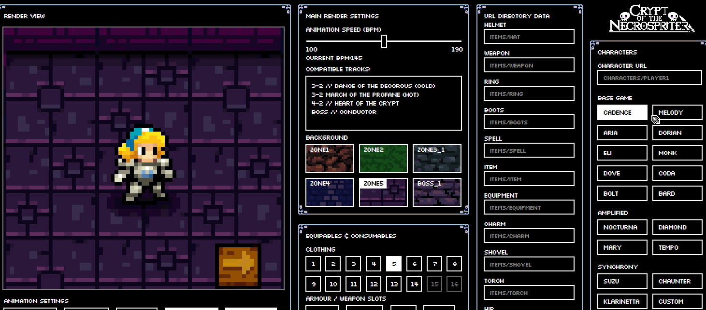

<pre>

██████╗██████╗ ██╗   ██╗██████╗ ████████╗
██╔════╝██╔══██╗╚██╗ ██╔╝██╔══██╗╚══██╔══╝
██║     ██████╔╝ ╚████╔╝ ██████╔╝   ██║   
██║     ██╔══██╗  ╚██╔╝  ██╔═══╝    ██║   
╚██████╗██║  ██║   ██║   ██║        ██║   
 ╚═════╝╚═╝  ╚═╝   ╚═╝   ╚═╝        ╚═╝   
┌─┐┌─┐  ┌┬┐┬ ┬┌─┐
│ │├┤    │ ├─┤├┤ 
└─┘└     ┴ ┴ ┴└─┘
███╗   ██╗███████╗ ██████╗██████╗  ██████╗ ███████╗██████╗ ██████╗ ██╗████████╗███████╗██████╗ 
████╗  ██║██╔════╝██╔════╝██╔══██╗██╔═══██╗██╔════╝██╔══██╗██╔══██╗██║╚══██╔══╝██╔════╝██╔══██╗
██╔██╗ ██║█████╗  ██║     ██████╔╝██║   ██║███████╗██████╔╝██████╔╝██║   ██║   █████╗  ██████╔╝
██║╚██╗██║██╔══╝  ██║     ██╔══██╗██║   ██║╚════██║██╔═══╝ ██╔══██╗██║   ██║   ██╔══╝  ██╔══██╗
██║ ╚████║███████╗╚██████╗██║  ██║╚██████╔╝███████║██║     ██║  ██║██║   ██║   ███████╗██║  ██║
╚═╝  ╚═══╝╚══════╝ ╚═════╝╚═╝  ╚═╝ ╚═════╝ ╚══════╝╚═╝     ╚═╝  ╚═╝╚═╝   ╚═╝   ╚══════╝╚═╝  ╚═╝   

</pre>
A Javascript Crypt Of The Necromancer Sprite-sheet Renderer  

<pre>FEATURES:</pre>
* A fully featured character selector from the base game, Amplified DLC and the Synchrony DLC.
  - 22 Characters are featured in total, featuring:
    * 11 base game characters
    * 4 'amplified' DLC characters
    * 3 'Synchrony' DLC characters
    * 4 Custom characters created by Thea Vanherst as hard coded examples.
      - 2 Fully featured redesigns of Nocturna & Flarinetta, known as Vahn and Yumi
      - 2 Shadow / Clone redesigns of Nocturna & Flarinetta respectively.
  - Custom URL injector for individual characters  Via. `characters/{image}.png`
    * URLs that are changed during software usage will be stored locally and retained until page refresh.
  - Character preview can be flipped to change the character direction.
  - 'Amplification mode' toggle and preview from the 'Amplified' DLC.
    * Character amplification toggling per character dependent on availability for said character.
* Dynamic clothing selection, based on the character selected.
  - Each character will have different sets of clothing available to them based on how many types of clothing said character has available.
  - Unique clothing functions for specific characters. Eg. Nocturna & her bat mode.
    * Clothing specific offsets per character & clothing set.
- Equipment animation preview with character specific offsets & settings.
  - A total of 13 different equipable slots
    * 5 equipable slots known as Helmet, Weapon, Wrist, Charm, Hip and Boots.
    * Toggleable shield preview.
      - Shield has directional controls depending on which direction the character is facing.
    * 1 Special weapon specific to characters such as Chaunter.
    * 3 Equipment slots known as Food, Torch and Shovel.
  - Designated URL assignment to individual item types. Via. `items/{image}.png`
    * URL Validation on address entry & error notification.
  - Items can be disabled / enabled depending on if the respective character can equip.
    * Toggling between characters displays an animation to notify the differences between characters clearly.
  - Items can also be disabled specific to both character & clothing set.
- Background image selection and toggle with the character preview.
  - 8 different floor types, including a dance floor mode and a multiplier mode.
* Foreground render preview, to show a closer resemblance to how sprites are rendered in-game.
  - 10 total foregrounds included by default with additional expandability, each of which depend on the floor type you select.
* Individual frame selecting, alongside render previewing based on BPM.
  - Render speed slider based on beats per minute, based on tracks featured in that game.
  - A list of tracks featured in the game at each BPM step of 5, including bosses.
- Scaling feature, with a slider to change the resolution size of the left hand side preview.
- Two different render modes, linear and the more accurate in-game beat driven render.

<pre>DEMO:</pre>

<picture>
  
</picture>

Crypt of the Necrospriter also features a playable version of Vahn as Nocturna, and Yumi as Klarinetta, including all Armour sets & transformation types.
Both characters were drawn and tested using the software as a proof of concept - Available on the Steam Workshop: [Vahn as Nocturna][1].

[1]: https://steamcommunity.com/sharedfiles/filedetails/?id=2893560157

<pre>INSTRUCTIONS:</pre>

To launch, double click `main.html` and open it through your preferred browser. 
Updating spritesheets will require your own external software. Edited sheets can be updated via. the refresh button at the bottom right of the render view.

To test your animations, replace the sprite-sheets in the `/characters` folder, and click the refresh icon under the render preview. 
You can also do the same thing by changing the URL via. the URL changer of the associated item and using the refresh button under the renderer to update the live preview.  
Refreshing the page will clear any custom inserted urls as no cookie system is currently present in the current version of the software.

To change the file name of the associated character, `/Data_Libraries/characterData.js` contains all character related data, including associated image data.
File urls are assigned by `fileUrl: "{url}"` in the Settings object, with the extensions of each sheet (body & head) being assigned via. `headExt:` and `bodyExt:` respectively. 
Examples of how to specify the directory are displayed in the text-boxes beforehand as an example. Eg; `"file root"/"imagename"."format"`.
If you require examples of usage, refer to `/Data_Libraries/characterDefaultSettings.js`. This sheet contains all the available datatype that can be associated to characters. 

To add a character, add an object on the chain of characters in `/Data_Libraries/characterData.js` and it'll be added automatically and assigned to the associated DLC.
DLCs are assigned via. `dlc: {number}`, and the name will be fetched via `dlcTypes` at the top of the sheet. It is generally recommended to keep them associated with `dlc: 3` for clarity. 
Note: Adding a character as an object via. `/Data_Libraries/characterData.js` REQUIRES a page refresh to update.

<picture>
  
</picture>

Similar to character sheets, item directories on launch are determined by `'JS_Libraries/itemData.js'`.
Any invalid urls will be detected on page-start up and notify you after page initialization.
Changing the boolean values in the itemData.js file will change their default visibility.

<pre>NOTES:</pre>

- Hovering the cursor over the render window and scrolling has the same functionality as the scale slider.
- The BPM is slightly inaccurate and isn't a 100% accurate representation of the BPM as displayed.

<pre>UPCOMING:</pre>

- Debug information user interface [?]
- BPM timer rework [?]
- Input for custom floor URL [?]

If you need any assistance in using the tool, designing sprites or have any
recommendations for the sprite renderer - contact me via Twitter (@TheaVanherst) or on discord (TheaVanherst#1953).
