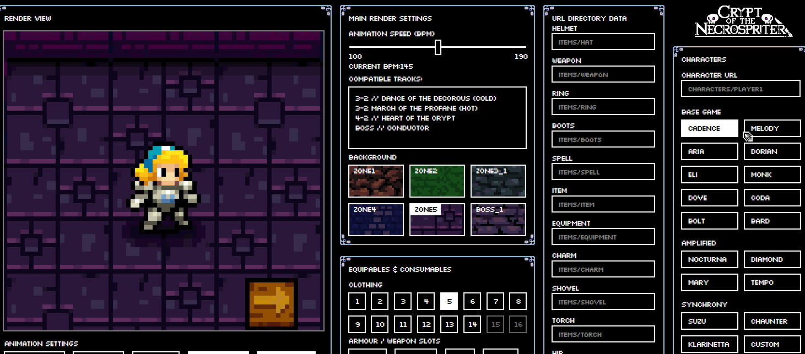

<pre>

██████╗██████╗ ██╗   ██╗██████╗ ████████╗
██╔════╝██╔══██╗╚██╗ ██╔╝██╔══██╗╚══██╔══╝
██║     ██████╔╝ ╚████╔╝ ██████╔╝   ██║   
██║     ██╔══██╗  ╚██╔╝  ██╔═══╝    ██║   
╚██████╗██║  ██║   ██║   ██║        ██║   
 ╚═════╝╚═╝  ╚═╝   ╚═╝   ╚═╝        ╚═╝   
┌─┐┌─┐  ┌┬┐┬ ┬┌─┐
│ │├┤    │ ├─┤├┤ 
└─┘└     ┴ ┴ ┴└─┘
███╗   ██╗███████╗ ██████╗██████╗  ██████╗ ███████╗██████╗ ██████╗ ██╗████████╗███████╗██████╗ 
████╗  ██║██╔════╝██╔════╝██╔══██╗██╔═══██╗██╔════╝██╔══██╗██╔══██╗██║╚══██╔══╝██╔════╝██╔══██╗
██╔██╗ ██║█████╗  ██║     ██████╔╝██║   ██║███████╗██████╔╝██████╔╝██║   ██║   █████╗  ██████╔╝
██║╚██╗██║██╔══╝  ██║     ██╔══██╗██║   ██║╚════██║██╔═══╝ ██╔══██╗██║   ██║   ██╔══╝  ██╔══██╗
██║ ╚████║███████╗╚██████╗██║  ██║╚██████╔╝███████║██║     ██║  ██║██║   ██║   ███████╗██║  ██║
╚═╝  ╚═══╝╚══════╝ ╚═════╝╚═╝  ╚═╝ ╚═════╝ ╚══════╝╚═╝     ╚═╝  ╚═╝╚═╝   ╚═╝   ╚══════╝╚═╝  ╚═╝   

</pre>
A Javascript Crypt Of The Necromancer Sprite-sheet Renderer  

<pre>FEATURES:</pre>
* A fully featured character selector from the base game, Amplified DLC and the Synchrony DLC.
  - Custom URL injector for individual characters
  - Character preview can be flipped to change the character direction.
  - 'Amplification mode' toggle and preview from the Amplified DLC.
    * Character amplification toggling per character dependent on availability.
* Dynamic clothing selection, based on the character selected.
  - Each character will have different sets of clothing available to them based on how many types of clothing said character has available.
  - Unique clothing functions for specific characters. Eg. Nocturna & her bat mode.
- Equipment animation preview with character specific offsets & settings.
  - Helmet, Weapon, Wrist, Charm, Hip and Boot equipables.
  - Special and Shield toggles equipables.
    - Shield has directional controls depending on which direction the character is facing.
  - Equipment slots such as Food, Torch and Shovel.
  - Designated URL assignment to individual item types. Via. `directory/image`
    - URL Validation on address entry & error notification.
  - Items disable / enable depending on if the respective character can equip.
    * Toggling between characters displays an animation to notify the differences between characters clearly.
- Background image selection and toggle with the character preview.
  - 8 different floor types, including a dance floor mode and a multiplier mode.
* Foreground render preview, to show a closer resemblance to how sprites are rendered in-game.
  - 10 total foregrounds included by default with additional expandability, each of which depend on the floor type you select.
* Individual frame selecting, alongside render previewing based on BPM.
  - Render speed slider based on beats per minute, based on tracks featured in that game.
  - A list of tracks featured in the game at each BPM step of 5, including bosses.
- Scaling feature, with a slider to change the resolution size of the left hand side preview.
- Two different render modes, linear and the more accurate in-game beat driven render.

<pre>DEMO:</pre>

<picture>
  
</picture>

Crypt of the Necrospriter also features a playable version of Vahn as Nocturna, and Yumi as Klarinetta, including all Armour sets & transformation types.
Both characters were drawn and tested using the software as a proof of concept - Available on the Steam Workshop: [Vahn as Nocturna][1].

[1]: https://steamcommunity.com/sharedfiles/filedetails/?id=2893560157

<pre>INSTRUCTIONS:</pre>

To launch, double click `main.html` and open it through your preferred browser. 
Updating spritesheets will require your own external software. Edited sheets can be updated via. the refresh button at the bottom right of the render view.

To test your animations, replace the sprite-sheets in the `/characters` folder, and click the refresh icon under the render preview. 
Refreshing the page will do the same thing, although you may reset custom directory entries you may have inserted for that character as no cookie system is currently present in the current version of the software.

To change the file name of the associated character, `/Data_Libraries/characterData.js` contains all character related data, including associated image data. 
You can also change them using the URL directory by just typing the directory it's in and the file name + format. 
File urls are assigned by `fileUrl: "{url}"` in the Settings object, with the extensions of each sheet (body & head) being assigned via. `headExt:` and `bodyExt:` respectively. 
Examples of how to specify the directory are displayed in the text-boxes beforehand as an example. Eg; `"file root"/"imagename"."format"`. 
If you require examples of usage, refer to `/Data_Libraries/characterDefaultSettings.js`. This sheet contains all the available datatype that can be associated to characters. 

To add a character, add an object on the chain of characters in `/Data_Libraries/characterData.js`, and it'll be added automatically and assigned to the associated DLC. 
DLCs are assigned via. `dlc: {number}`, and the name will be fetched via `dlcTypes` at the top of the sheet. It is generally recommended to keep them associated with `dlc: 3`. 
Note: Adding a character as an object via. `/Data_Libraries/characterData.js` REQUIRES a page refresh to update.

<pre>NOTES:</pre>

Each sprite-sheet is individually programmable per character based on the directory.
So if you wish to change the sprite-sheet directory for a specific character, select the character you wish to change, and type it in the assosiated field, you then can change character to whomever you want and the directory data will be locally stored.
If you wish to reset the custom entries, simply refresh the page and everything will be set back to the default directories.

Different characters have different file formatting, so be aware of the file naming conventions Crypt of the Necrodancer has, as a lot of these adjustments are pre-baked into the code to try and compensate for such. So I would just recommend to not try to change the naming convention too much.

Directories on launch are determined by the data that is in `'Data_Libraries/characterData.js'`.
Change the url directory, and it'll update - on page refresh it will then default to the new directory you inserted.

<picture>
  
</picture>

Item directories on launch are determined by `'JS_Libraries/itemData.js'`.
Any invalid urls will be detected on page-start up and notify you after page initialization.
Changing the boolean values in the itemData.js file will change their default visibility.
<pre>UPCOMING:</pre>

- Debug information user interface [?]
- BPM timer rework [?]
- Input for custom floor URL [?]

If you need any assistance in using the tool, designing sprites or have any
recommendations for the sprite renderer - contact me via Twitter (@TheaVanherst) or on discord (TheaVanherst#1953).
